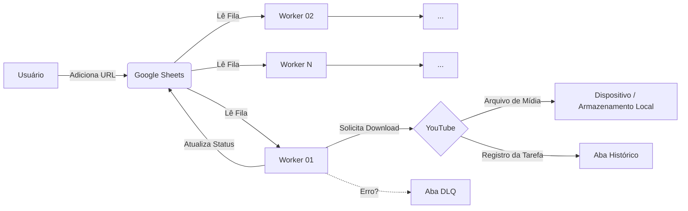

# YT G-Sheets Download Audio Worker

[](https://www.python.org/downloads/)
[](LICENSE)
[](Dockerfile)

Worker de processamento distribuído que conecta a orquestração via **Google Sheets** com o motor de download **yt-dlp**.

O sistema opera em background, monitorando uma planilha, reivindicando URLs de vídeos, baixando o áudio e reportando o status.

---

## Arquitetura



## Funcionalidades

- **Zero Configuração de Tabela**: O worker cria automaticamente as abas (`Tasks`, `Tasks History`, `Tasks DLQ`) e os cabeçalhos na planilha se não existirem.
- **Resiliência a Falhas**:
  - Erros são capturados e enviados para a **DLQ** (Dead Letter Queue) com a mensagem exata do erro.
  - **Backoff Exponencial**: O worker "dorme" progressivamente quando não há tarefas, economizando recursos.

## Pré-requisitos

1. **Google Cloud Service Account**: Um arquivo `credentials.json` com permissão de editor na planilha desejada.
   - **Importante**: Se você não é o gestor da planilha, solicite ao administrador que adicione o e-mail da sua Service Account como editor na planilha do Google Sheets e forneça o id da planilha.
2. **Docker** (Recomendado) OU **Python 3.10+** com FFmpeg instalado.

## Instalação e Uso

### 1. Configuração do Ambiente

Crie um arquivo `.env` na raiz:

```ini
WORKER_NAME=worker-alpha
SPREADSHEET_ID=seu_id_da_planilha_aqui
# No Docker, este caminho é fixo:
SERVICE_ACCOUNT_FILE=/app/credentials.json
```

### 2. Rodando com Docker (Produção)

A imagem Docker já inclui Python, FFmpeg, Git e Node.js.

```bash
# 1. Construir
docker build -t audio-worker .

# 2. Rodar (Background)
# Certifique-se de que o arquivo 'credentials.json' está na pasta atual
docker run -d \
  --name audio-worker \
  --restart unless-stopped \
  --env-file .env \
  -v $(pwd)/credentials.json:/app/credentials.json \
  -v $(pwd)/downloads:/app/downloads \
  audio-worker
```

**Windows PowerShell**: Use `${PWD}` ao invés de `$(pwd)`:
```powershell
docker run -d --name audio-worker --restart unless-stopped --env-file .env -v ${PWD}/credentials.json:/app/credentials.json -v ${PWD}/downloads:/app/downloads audio-worker
```

**Gerenciar o container:**

```bash
# Ver logs em tempo real
docker logs audio-worker -f

# Parar o worker (envia SIGTERM, aguarda finalização)
docker stop audio-worker

# Iniciar novamente
docker start audio-worker

# Remover o container
docker rm audio-worker
```

### 3. Executando Manualmente (Python)

Se preferir rodar sem Docker, instale o **FFmpeg** no seu sistema primeiro.

```bash
# Instalação
uv sync  # ou: pip install .

# Execução
python -m yt_gsheets_audio_worker
```

## Estrutura da Planilha

Não se preocupe em criar colunas manualmente! O sistema é **auto-gerenciável**.

Basta criar uma planilha em branco no Google Sheets, copiar o ID da URL para o seu `.env`, e iniciar o worker. Ele criará automaticamente toda a estrutura de banco de dados necessária:

### Entrada de Dados
* **`Sources`**: É aqui que você trabalha. Cole as URLs de playlists, canais ou vídeos individuais. O sistema monitora esta aba.
* **`Tasks`**: Fila de processamento interna. O sistema converte *Sources* em *Tasks* individuais (vídeo a vídeo) aqui.

### Histórico e Logs
* **`Sources History`** e **`Tasks History`**: Registro de tudo o que foi processado com sucesso.
* **`Workers`**: Monitoramento em tempo real. Veja quais workers estão online/ativos e suas estatísticas.

### Tratamento de Erros (DLQ)
* **`Sources DLQ`** e **`Tasks DLQ`**: *Dead Letter Queue*. Se algo der errado (vídeo privado, erro de download, etc.), o item é movido para cá com uma mensagem de erro detalhada na última coluna.

### Sistema Interno
* **`Eleição de Líderes`**: Controle interno para garantir que múltiplos workers não processem a mesma fonte simultaneamente.


## Bibliotecas Core

Este repositório atua como a "cola" de integração. A lógica reside em:

- **Orquestração**: [yt-gsheet-orchestrator](https://github.com/AndreKoraleski/YT-G-Sheets-Orchestrator)
- **Engine**: [yt-audio-dl](https://github.com/AndreKoraleski/yt_audio_dl)

## Suporte

Em caso de dúvidas ou problemas, entre em contato:
- GitHub: [@andrekoraleski](https://github.com/AndreKoraleski)
- Email: andrekorale@gmail.com

## Licença

MIT
