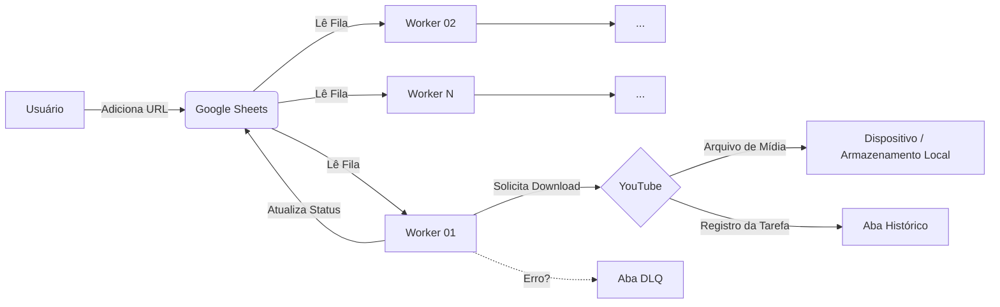

# YT G-Sheets Download Audio Worker

[](https://www.python.org/downloads/)
[](LICENSE)
[](Dockerfile)

Worker de processamento distribuído que integra uma planilha do **Google Sheets** ao mecanismo de download **yt-dlp**.

O sistema funciona em background, monitorando uma planilha, obtendo URLs de vídeos, realizando o download do áudio e registrando o status de cada tarefa.

---

## Arquitetura



## Funcionalidades

* **Inicialização Automática da Planilha**: O worker cria automaticamente as abas (`Tasks`, `Tasks History`, `Tasks DLQ`) e os cabeçalhos na planilha caso ainda não existam.
* **Tratamento de Falhas**:

  * Erros são registrados na **DLQ** (Dead Letter Queue) juntamente com a mensagem do erro.
  * **Backoff Exponencial**: O intervalo entre leituras da fila aumenta progressivamente quando não há tarefas.

## Pré-requisitos

1. **Google Cloud Service Account**: Arquivo `credentials.json` com permissão de editor na planilha desejada.

   * **Importante**: Caso você não seja o proprietário da planilha, solicite ao administrador que adicione o e-mail da Service Account como editor e informe o ID da planilha.
2. **Docker** (opcional) ou **Python 3.10+** com FFmpeg instalado.

## Instalação e Uso

### 1. Configuração do Ambiente

Crie um arquivo `.env` na raiz do projeto:

```ini
WORKER_NAME=worker-alpha
SPREADSHEET_ID=seu_id_da_planilha_aqui
# No Docker, este caminho é fixo:
SERVICE_ACCOUNT_FILE=/app/credentials.json
```

### 2. Execução com Docker

A imagem Docker inclui Python, FFmpeg, Git e Node.js.

```bash
# 1. Construir a imagem
docker build -t audio-worker .

# 2. Executar em background
# Certifique-se de que o arquivo 'credentials.json' está na pasta atual
docker run -d \
  --name audio-worker \
  --restart unless-stopped \
  --env-file .env \
  -v $(pwd)/credentials.json:/app/credentials.json \
  -v $(pwd)/downloads:/app/downloads \
  audio-worker
```

**Windows PowerShell**: Use `${PWD}` no lugar de `$(pwd)`:

```powershell
docker run -d --name audio-worker --restart unless-stopped --env-file .env -v ${PWD}/credentials.json:/app/credentials.json -v ${PWD}/downloads:/app/downloads audio-worker
```

**Gerenciamento do container:**

```bash
# Acompanhar logs
docker logs audio-worker -f

# Parar o worker
docker stop audio-worker

# Iniciar novamente
docker start audio-worker

# Remover o container
docker rm audio-worker
```

### 3. Execução Manual (Python)

Se optar por executar sem Docker, instale o **FFmpeg** previamente.

```bash
# Instalação das dependências
uv sync  # ou: pip install .

# Execução
python -m yt_gsheets_audio_worker
```

## Estrutura da Planilha

A estrutura necessária é criada automaticamente pelo sistema.

Basta criar uma planilha em branco, copiar o ID da URL para o arquivo `.env` e iniciar o worker.

### Entrada de Dados

* **`Sources`**: Aba usada para inserir URLs de playlists, canais ou vídeos individuais.
* **`Tasks`**: Fila interna de processamento, gerada a partir das entradas em *Sources*.

### Histórico e Monitoramento

* **`Sources History`** e **`Tasks History`**: Registro das tarefas concluídas.
* **`Workers`**: Monitoramento dos workers ativos e suas estatísticas.

### Tratamento de Erros (DLQ)

* **`Sources DLQ`** e **`Tasks DLQ`**: Armazenam itens que falharam no processamento, com a mensagem de erro correspondente.

### Sistema Interno

* **`Eleição de Líderes`**: Mecanismo interno para impedir que múltiplos workers processem a mesma fonte simultaneamente.

## Bibliotecas Relacionadas

Este repositório faz a integração entre dois outros projetos, onde está concentrada a maior parte da lógica:

* **Orquestração**: [yt-gsheet-orchestrator](https://github.com/AndreKoraleski/YT-G-Sheets-Orchestrator)
* **Engine**: [yt-audio-dl](https://github.com/AndreKoraleski/yt_audio_dl)

## Suporte

Em caso de dúvidas ou problemas:

* GitHub: [@andrekoraleski](https://github.com/AndreKoraleski)
* Email: [andrekorale@gmail.com](mailto:andrekorale@gmail.com)

## Licença

MIT
